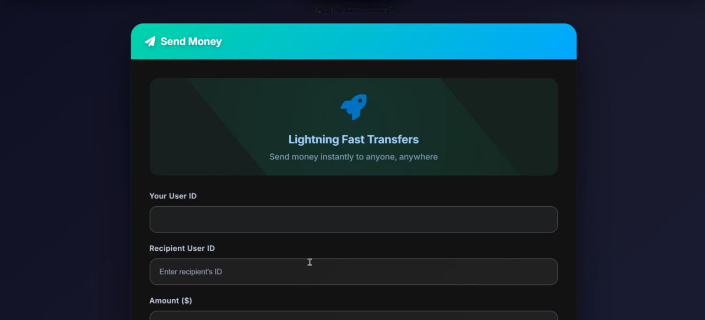

# mini-instapay
Mini-InstaPay is a distributed payment system using microservices architecture with Docker and Kubernetes. It ensures scalable, reliable payment processing with independent services for easy deployment and maintenance in cloud environments.

## 🎥 Demo Video

